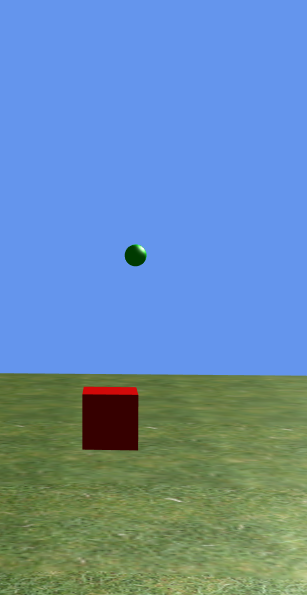

# 物理系统之ConfigurableConstraint

###### *version :2.7.0beta   Update:2020-6-2*

可配置约束具有其他约束类型的所有功能，并且可以更好地控制角色运动。 
当您要自定义布娃娃的运动并在角色上强制某些姿势时，它们特别有用。 也可以使用它们来将约束修改为自己设计的高度专业的约束。


**ConfigurableConstraint介绍**

可配置约束使得用户拥有配置该约束六个自由度的能力，这六个自由度包括三个线性轴上的运动，即平移运动，三个围绕轴的角运动。每个自由度都可以配置为锁定、受限和自由。并且还可以配置是否可以突破限制，在限制的最大或者最小位置上是否受到反弹力的作用等。用户拥有更为强大的自定义约束的能力。

**ConfigurableConstraint相关属性和功能介绍**

| 属性                                       | 对应Unity属性                      | 含义                                       |
| ---------------------------------------- | ------------------------------ | ---------------------------------------- |
| setAxis(axis:Vector3,secondaryAxis:Vector3) | Axis和Secondary Axis            | 设置对象自然旋转的局部轴主轴                           |
| XMotion                                  | XMotion                        | 设置x轴线性轴上运动的模式                            |
| YMotion                                  | YMotion                        | 设置y轴线性轴上运动的模式                            |
| ZMotion                                  | ZMotion                        | 设置z轴线性轴上运动的模式                            |
| angularXMotion                           | Angular X Motion               | 设置绕x轴旋转运动的模式                             |
| angularYMotion                           | Angular Y Motion               | 设置绕y轴旋转运动的模式                             |
| angularZMotion                           | Angular Z Motion               | 设置绕z轴旋转运动的模式                             |
| linearLimitSpring                        | Linear Limit  Spring           | 设置线性轴上的弹簧弹力，Unity中三个线性轴是统一的值，Laya可以分别设置。Spring 为将对象移动回限制 (Limit) 而应用的力的强度任何非 0 数值都会隐式地软化边界。 |
| linearDamp                               | Linear Limit  Damper           | 阻尼系数，弹簧力的减小与约束运动的速度成正比。设置一个大于零的值可以使约束“抑制”振荡，否则振荡将无限期地持续下去。 |
| maxLinearLimit和 minLinearLimit           | Linear Limit  Limit            | 为约束的线性运动（即，沿距离而不是旋转的运动）设置一个极限，指定为距约束原点的距离。Unity中最小值为最大值取反。Laya可以分别设置不同的值。 |
| linearBounce                             | Linear Limit  Bounciness       | 设置向对象施加反弹力，以在到达极限距离时将其推回。取值范围[0, 1.0]    |
| 未实现                                      | Linear Limit  Contact Distance |                                          |
| angularLimitSpring                       | Angular X Y Z Limit Spring     | 当物体超过约束的极限角度时，施加弹簧扭矩以使物体向后旋转。            |
| angularDamp                              | Angular X  Y Z Limit Damper    | 阻尼系数，弹簧扭矩的减小与约束旋转速度成正比。设置一个大于零的值可以使约束“抑制”振荡，否则振荡将无限期地持续下去。 |
| minAngularLimit/ maxAngularLimit         | Low/High Angular X Y Z Limit   | 约束绕x y z轴旋转的下限/上限，指定为与约束原始旋转的角度。         |
| angularBounce                            | Angular X Bounciness           | 设置当对象旋转达到极限角度时要施加到对象的反弹扭矩。               |
| 未实现                                      | Low Angular X Contact Distance |                                          |
|                                          |                                |                                          |

补充说明：

1.在设置Angular的三个自由度的时候，Unity较为分散，需要开发者找好对应关系，Laya就是通过angularLimitSpring、angularDamp、minAngularLimit、maxAngularLimit和angularBounce属性进行设置的。

2.Unity中的关节驱动模式，在当前版本(2.7.0beta)未能完全实现，会在后续的版本陆续实现。


**在LayaAir中使用ConfigurableConstraint**

- 1.创建两个刚体，创建约束，为约束绑定两个刚体

```typescript
var boxA:MeshSprite3D = this.addRigidBodySphere(new Vector3(7, 3, 0),1);
var boxARigid:Rigidbody3D = boxA.getComponent(Rigidbody3D);
boxARigid.overrideGravity = true;
boxARigid.isKinematic = true;

var boxB:MeshSprite3D = this.addRigidBodyBox(new Vector3(10, 0, 0),1);
(boxB.meshRenderer.material as BlinnPhongMaterial).albedoColor = new Vector4(1, 0, 0, 1);
var boxBRigid:Rigidbody3D = boxB.getComponent(Rigidbody3D);
//创建约束
var configurableConstraint:ConfigurableJoint = boxA.addComponent(ConfigurableConstraint); 
//为约束设置两个连接刚体
configurableConstraint.setConnectRigidBody(boxARigid,boxBRigid);
```

- 2.设置锚点anchor和连接锚点connectAnchor

```typescript
//设置锚点anchor
configurableConstraint.anchor = new Vector3(0, -3, 0);
//设置连接锚点connectAnchor
configurableConstraint.connectAnchor = new Vector3(0,0,0);
```

锚点和连接锚点的说明:

六个自由度的锁定、限制以及自由是基于两个锚点来计算的。锚点anchor是“绑定”于setConnectRigidBody的第一个刚体上的，连接锚点connectAnchor是“绑定”于setConnectRigidBody的第二个刚体上的。两个锚点都是基于其绑定的刚体的坐标进行计算的(锚点的坐标是刚体的局部空间)。以x轴为例：

boxARigid的位置为(0, 0, 0),anchor为(0, 0, 0)，那么anchor的世界坐标为(0, 0, 0)

boxBRigid的位置为(5, 0, 0),connectAnchor为(0, 0, 0)，那么connectAnchor的世界坐标为(5, 0, 0)。

仅考虑x轴线性运动的约束的情况：

如果模式锁定(Locked),那么需要anchor的世界坐标等于connectAnchor的世界坐标，即两个点需要重合。anchor的世界坐标为(0, 0, 0)，connectAnchor的世界坐标为(5, 0, 0)，两个锚点不重合，那么物理引擎将驱动迫使刚体运动以使得两个锚点重合。即boxARigid平移(5, 0, 0)或者boxBRigid平移(-5, 0, 0)。如果anchor为(0, 0, 0)， connectAnchor为(-5, 0, 0)，两个锚点的世界坐标刚好重合，两个刚体将保持位置不动(在x轴方向上，线性)。

如果模式为限制模式(Limited)，maxLinearLimit设置x轴为2， minLinearLimit设置x轴为-2，那么两个锚点世界坐标的x值可以不重合，两者的距离在[-2, 2]范围内都是允许的。

如果模式为自由模式(Free)，那么两个锚点不重合是被允许的，符合x轴上的约束是自由的设定。

- 3.为约束的线性运动（即，沿距离而不是旋转的运动）设置一个极限，分最大值和最小值

```typescript
configurableConstraint.minLinearLimit = new Vector3(-3,0,0);
configurableConstraint.maxLinearLimit = new Vector3(3,0,0);
```

- 4.设置六个自由度的模式(有Locked、Limited、Free)

   configurableConstraint.XMotion = ConfigurableConstraint.CONFIG_MOTION_TYPE_LIMITED;
   	configurableConstraint.YMotion = ConfigurableConstraint.CONFIG_MOTION_TYPE_LOCKED;
   	configurableConstraint.ZMotion = ConfigurableConstraint.CONFIG_MOTION_TYPE_LOCKED;
   	configurableConstraint.angularXMotion= ConfigurableConstraint.CONFIG_MOTION_TYPE_LOCKED;
   	configurableConstraint.angularYMotion= ConfigurableConstraint.CONFIG_MOTION_TYPE_LOCKED;
   	configurableConstraint.angularZMotion= ConfigurableConstraint.CONFIG_MOTION_TYPE_LOCKED;
- 5.设置线性轴上的弹簧弹力和阻尼系数

```typescript
configurableConstraint.linearLimitSpring = new Vector3(100,0,0);
configurableConstraint.linearDamp = new Vector3(0,0,0);
```

- 6.设置反弹力

```typescript
configurableConstraint.linearBounce = new Vector3(0.5, 0, 0);
```


**以LayaAir的示例进行说明：**

```typescript
bounceTest(): void {
    var boxA:MeshSprite3D = this.addRigidBodySphere(new Vector3(7, 3, 3),1);
    var boxARigid:Rigidbody3D = boxA.getComponent(Rigidbody3D);

    var boxB:MeshSprite3D = this.addRigidBodyBox(new Vector3(7, 0, 3),1);
    (boxB.meshRenderer.material as BlinnPhongMaterial).albedoColor = new Vector4(1, 0, 0, 1);
    var boxBRigid:Rigidbody3D = boxB.getComponent(Rigidbody3D);

    var configurableConstraint:ConfigurableJoint = boxA.addComponent(ConfigurableConstraint); 
    configurableConstraint.setConnectRigidBody(boxARigid,boxBRigid);
    configurableConstraint.anchor = new Vector3(0, -3, 0);
    configurableConstraint.connectAnchor = new Vector3(0,0,0);

    configurableConstraint.minLinearLimit = new Vector3(-2,0,0);
    configurableConstraint.maxLinearLimit = new Vector3(2,0,0);
    configurableConstraint.XMotion = ConfigurableConstraint.CONFIG_MOTION_TYPE_LIMITED;
    configurableConstraint.YMotion = ConfigurableConstraint.CONFIG_MOTION_TYPE_LOCKED;
    configurableConstraint.ZMotion = ConfigurableConstraint.CONFIG_MOTION_TYPE_LOCKED;
    configurableConstraint.angularXMotion= ConfigurableConstraint.CONFIG_MOTION_TYPE_LOCKED;
    configurableConstraint.angularYMotion= ConfigurableConstraint.CONFIG_MOTION_TYPE_LOCKED;
    configurableConstraint.angularZMotion= ConfigurableConstraint.CONFIG_MOTION_TYPE_LOCKED;

    configurableConstraint.linearBounce = new Vector3(0.5, 0, 0);
    boxBRigid.applyImpulse(new Vector3(100, 0, 0));

}
```

示例解析:

​		1.创建了两个刚体，位置分别为(7, 3, 3)，(7, 0, 3)

​		2.创建一个ConfigurableConstraint约束，绑定两个刚体。

​		3.设置anchor和connectAnchor两个锚点，通过计算，会得到两个锚点在世界坐标中是重合的。

​		4.为约束的线性运动设置极限，x方向上最大值为2， 最小值为-2。

​		5.设置x轴线性轴上运动的模式为LIMITED，其他自由度上为LOCKED，由于两个锚点已经重合，所以物理引擎不会在六个自由度迫使刚体产生运动。

​		6.设置x线性轴上的弹簧弹力为0.5.

​		7.赋予刚体一个冲量

最终效果，刚体B将在x轴方向上运动，由于设置了linearBounce，那么刚体B在到达x线性运动设置极限时，将被弹回(像是撞上了有弹性的墙面)，来回弹来弹去，因为有默认的摩擦系数所以会慢慢停止。

示例效果展示：




