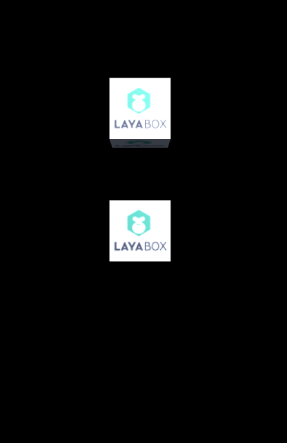
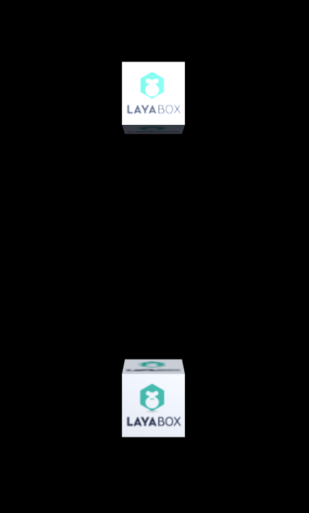
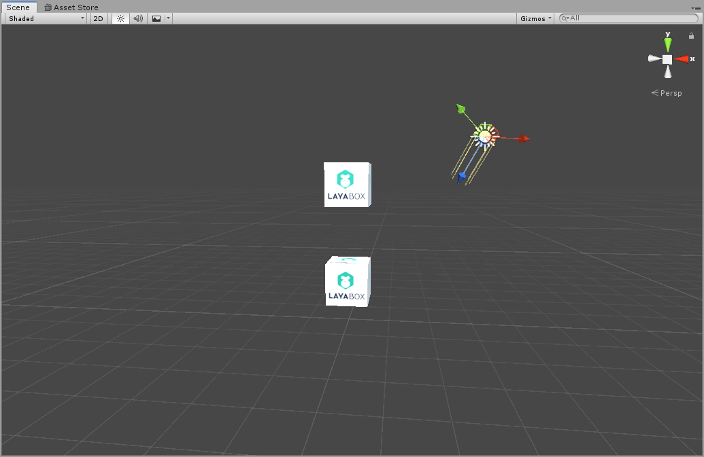
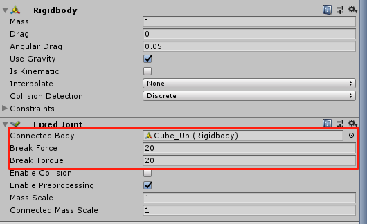
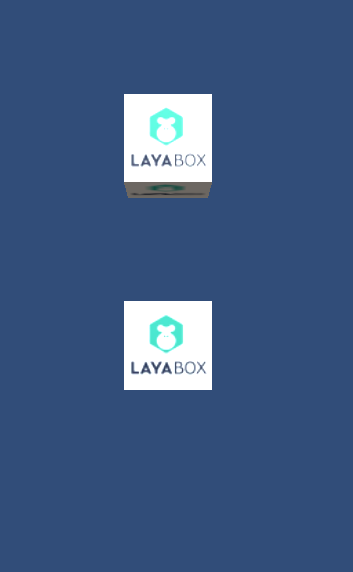

# 物理系统之FixedConstraint

###### *version :2.7.0beta   Update:2020-6-2*

固定约束将刚体的的运动限制为依赖于另一个刚体。 这有点像子父级关系，但是是通过物理而非变换(Transform)层次结构实现的。 固定约束非常适合你想能够轻松地分离的对象，或在变换(Transform)层次结构中没有子父级关系的情况下连接两个对象的运动。


**在LayaAir中使用FixedConstraint**

- 1.创建两个刚体

```typescript
        //创建盒型MeshSprite3D
		var box: MeshSprite3D = this.scene.addChild(new 	      MeshSprite3D(PrimitiveMesh.createBox(1, 1, 1))) as MeshSprite3D;
		//设置材质
		var transform: Transform3D = box.transform;
		var pos: Vector3 = transform.position;
		pos.setValue(0, 5, 0);
		transform.position = pos;

		//创建刚体碰撞器
		var rigidBody: Rigidbody3D = box.addComponent(Rigidbody3D);
		//创建盒子形状碰撞器
		var boxShape: BoxColliderShape = new BoxColliderShape(1, 1, 1);
		//设置盒子的碰撞形状
		rigidBody.colliderShape = boxShape;
		
		//设置刚体的质量
		rigidBody.mass = 10;
		rigidBody.isKinematic = true;

		//创建盒型MeshSprite3D
		var box2: MeshSprite3D = this.scene.addChild(new MeshSprite3D(PrimitiveMesh.createBox(1, 1, 1))) as MeshSprite3D;
		//设置材质
		var transform2: Transform3D = box2.transform;
		var pos2: Vector3 = transform2.position;
		pos2.setValue(0, 3, 0);
		transform2.position = pos2;
		//创建刚体碰撞器
		var rigidBody2: Rigidbody3D = box2.addComponent(Rigidbody3D);
		//创建盒子形状碰撞器
		var boxShape2: BoxColliderShape = new BoxColliderShape(1, 1, 1);
		//设置盒子的碰撞形状
		rigidBody2.colliderShape = boxShape2;
		//设置刚体的质量
		rigidBody2.mass = 10;
```

- 2.创建FixedConstraint

```typescript
//以组件形式为刚体添加FixedConstraint
var fixedConstraint:FixedConstraint = box.addComponent(FixedConstraint);
//设置约束的锚点
fixedConstraint.anchor = new Vector3(0,0,0);
//设置约束的连接锚点
fixedConstraint.connectAnchor = new Vector3(0,2,0);
box.addComponent(FixedEventTest);
//使用约束连接两个刚体
fixedConstraint.setConnectRigidBody(rigidBody,rigidBody2);
```

- 3.设置约束的breakForce

```typescript
override public function onStart()
{
  this.fixedConstraint = this.owner.getComponent(FixedConstraint);
  //设置打破约束的力的阈值
  this.fixedConstraint.breakForce = 1000;
}

override public function onUpdate()
{
  if(this.fixedConstraint)
  {
    var mass = this.fixedConstraint.connectedBody.mass;
    this.fixedConstraint.connectedBody.mass = mass+1;
    //输出当前约束所受力
	console.log(this.fixedConstraint.currentForce);
	//输出当前约束所受的力矩
	console.log(this.fixedConstraint.currentTorque);
  }	

}

override public function onJointBreak()
{
  console.log("break");
}
```

- 4.示例效果展示

在初始时，box和box2都拥有Rigidbody3D组件，box刚体属性isKinematic为true，创建了一个FixedConstraint，box的刚体作为约束连接的第一个刚体，box2的刚体作为约束连接的第二个刚体，并且设置约束的锚点和约束的连接锚点(关于锚点和连接锚点将在ConfigurableJoint做说明)，在没有约束的时候，由于box刚体属性isKinematic为true，所以其不会受到重力的影响，box2刚体属性isKinematic为false，将会受到重力作用，自由下落。但是加了约束之后，box2刚体是约束的connectedBody，box刚体是约束的连接的第一个刚体，所以box2刚体的运动受到约束的限制，保持静止。(可以简单理解为box刚体和box2刚体在y方向上受到了FixedConstraint的约束，所以两者之间的距离不会拉大，所以box2保持静止)




在添加脚本FixedEventTest之后，设置了约束的breakForce为1000，在onUpdate中不断地增加box2刚体的质量，box2刚体所受的重力不断在加大，当达到约束的breakForce阈值时，将破坏约束，box2刚体做自由落体运动。如下图所示：




- 5.在Unity中使用FixedConstraint

  (1)在场景中添加了两个cube:Cube_Up和Cube_Down

  

  (2)分别为Cube_Up和Cube_Down添加刚体组件

  (3)为Cube_Down添加Fixed Joint组件，并设置Connected Body为Cube_Up的刚体。

  

  (4)使用Laya的Unity插件预览。

  效果如图所示：

  


