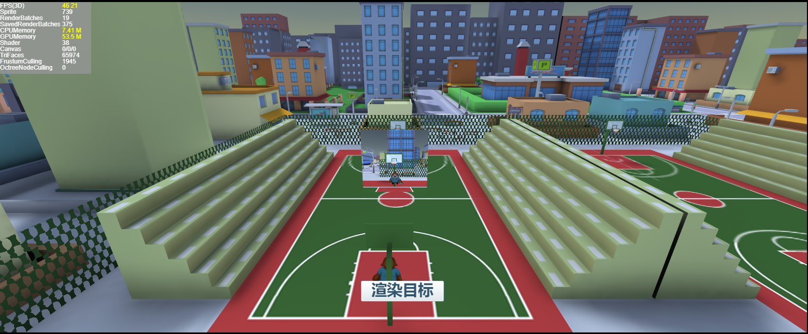

# 目标纹理的使用

###### *version :2.7.0beta   Update:2020-6-11*

​	目标纹理就是指摄像机的**RenderTarget**属性。它将摄像机的视图放置在一个纹理上，该纹理可以被应用到另一个对象。这样就可以方便地创建镜子，监控摄像机等效果了。注意的是使用了该属性的摄像机将禁用渲染到屏幕的功能。

​	这里我们使用的示例（[demo地址](https://layaair.ldc.layabox.com/demo2/?language=ch&category=3d&group=Camera&name=RenderTargetCamera)）的代码。camera为场景渲染摄像机，renderTargetCamera为开启RenderTarget属性的摄像机。

```typescript
//渲染到纹理的相机
var renderTargetCamera = scene.addChild(new Camera(0, 0.3, 1000));
renderTargetCamera.transform.position = new Vector3(-28.8, 8, -60);
renderTargetCamera.transform.rotate(new Vector3(0, 180, 0), true, false);
//选择渲染目标为纹理
renderTargetCamera.renderTarget = new RenderTexture(512, 512);
//渲染顺序
renderTargetCamera.renderingOrder = -1;
//清除标记
renderTargetCamera.clearFlag = BaseCamera.CLEARFLAG_SKY;
```

在LayaAir引擎中渲染顺序是越小渲染优先度越高。


将相机渲染的内容作为一张纹理赋予立方体的材质

```typescript
//设置网格精灵的纹理
mat.albedoTexture = renderTargetCamera.renderTarget;
```



