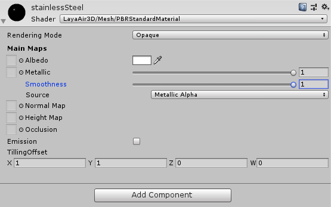
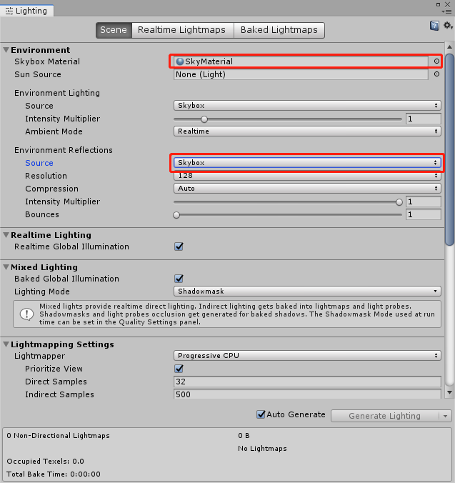

# 场景环境反射

###### *version :2.7.0beta   Update:2020-6-11*

​	场景环境反射分两种，天空盒反射与自定义反射。想要有反射效果就必须Shader中如果没有反射材质也是没有效果的，默认的BlinnPhong不支持，PBR材质是支持环境反射。关于环境反射更多的是推荐在Unity中设置好后再导出使用。

天空盒反射:直接反射指的是材质直接反射当前天空球的环境反射。这个暂未实现，会在后续的版本支持。

#### 如何使用Unity设置环境反射

1.首先来看我们准备好的一个材质球。

<br>(图1)

在这个材质球中，我们使用的是LayaAir3D提供的PBR标准材质。该材质将自动开启环境反射选项，同时为了更好的观察环境反射效果，我们将材质的Metallic金属度和Smoothness光滑度调整到最高。在设置之后我们将材质球添加一个预制体对象茶壶（由3Dmax导出的）。


2.然后我们给场景添加上天空盒。打开 **Window** -- **Lighting** -- **Setting**  界面。

<br>(图3)

设置好环境的天空球材质，然后在 `Environment Reflections` 环境反射中  Source 设置为SkyBox。

在设置好后，就可以在Unity中看到效果了，之后再导出使用。	

<br>(图4)

#### 使用代码设置环境反射

该部分代码节选自官方示例（[demo地址](https://layaair.ldc.layabox.com/demo2/?language=ch&category=3d&group=Scene3D&name=EnvironmentalReflection)）。

```js
//设置场景的反射模式(全局有效),场景的默认反射模式也是custom模式
scene.reflectionMode = Laya.Scene3D.REFLECTIONMODE_CUSTOM;

//天空盒
Laya.Material.load("res/threeDimen/skyBox/DawnDusk/SkyBox.lmat", Laya.Handler.create(null, function(mat) {
    //获取相机的天空盒渲染体
    var skyRenderer:SkyRenderer = camera.skyRenderer;
    //设置天空盒mesh
    skyRenderer.mesh = Laya.SkyBox.instance;
    //设置天空盒材质
    skyRenderer.material = mat;
    //设置场景的反射贴图
    scene.customReflection = mat.textureCube;
    //设置曝光强度
    var exposureNumber:Number = 0;
    mat.exposure = 0.6 + 1;
}));

.....

//加载Mesh
Laya.Mesh.load("res/threeDimen/staticModel/teapot/teapot-Teapot001.lm", Laya.Handler.create(null, function(mesh) {
    teapot = scene.addChild(new Laya.MeshSprite3D(mesh));
    teapot.transform.position = new Laya.Vector3(0, 1.75, 2);
    teapot.transform.rotate(new Laya.Vector3(-90, 0, 0), false, false);
}));

//实例PBR材质
var pbrMat = new Laya.PBRStandardMaterial();
//开启该材质的反射
pbrMat.enableReflection = true;
//设置材质的金属度，尽量高点，反射效果更明显
pbrMat.metallic = 1;

//加载纹理
Laya.Texture2D.load("res/threeDimen/pbr/jinshu.jpg", Handler.create(null, function(tex){
    //pbrMat.albedoTexture = tex;
    teapot.meshRenderer.material = pbrMat;
}));
```

<br>(图5)


