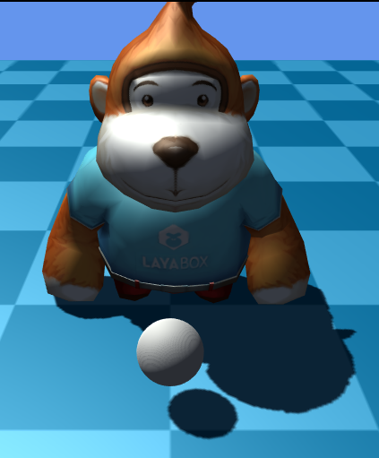

# 如何为灯光添加阴影

###### *version :2.6.1beta   Update:2020-4-30*

投影是灯光照射模型时产生的即时阴影，可随着灯光角度、灯光强度、模型位置等变化而变化。投影是3D世界最重要的因素之一，能产生更加强烈的立体感。

即时阴影非常损耗性能，不能用得太多，特别是游戏场景，模型量较大，一般我们不使用即时投影，而使用静态的光照贴图。

要让场景中产生投影，我们需了解灯光的以下属性：

**ShadowMode：**阴影模式，共分为四种模式：

​			     None：不产生阴影

​			     Hard：硬阴影，对性能要求较低

​			     SoftLow：低强度软阴影，对性能要求一般

​			     SoftHigh：高强度软阴影,对性能要求较高

**shadowDistance：**灯光产生阴影的范围，范围是指摄像机到模型的距离，超出这个范围的模型将不会产生阴影与接受阴影，开发者可以根据场景大小进行设置。

**shadowResolution：**阴影贴图分辨率，关系到阴影的质量，通过数值设置质量，数值越大，阴影质量越高，性能损耗也会随之加高。阴影贴图分辨率都是以2的N次幂为大小设置的，默认为2048，可以设置成512、1024…..等。

**shadowCascadesMode：**阴影的级联模式，数量越大，产生阴影贴图时，将视锥体划分的子视锥体越多，对应的阴影贴图也越多，阴影的质量会越好。

**shadowTwoCascadeSplits：**二级级联阴影分割比例。

**shadowFourCascadeSplits：**四级级联阴影分割比例,X、Y、Z依次为其分割比例,Z必须大于Y,Y必须大于X。

**shadowDepthBias：**阴影贴图基于深度的偏移，将深度做一个偏移可以有效解决阴影痤疮（"shadow acne"）。但需要提醒的是：在shadowDepthBias过大时会导致阴影脱离物体，即"Peter Panning"现象的出现。

**shadowNormalBias：**阴影贴图基于法线的偏移，将阴影Caster的表面沿着法线方向的反方向偏移，以防止自身阴影（“shadow acne”）伪影的出现。 较大的值可以更好地防止阴影痤疮（"shadow acne"），但要以阴影形状小于实际对象为代价。

**shadowStrength：**阴影强度，该值越大，阴影越明显。

**shadowNearPlane：**阴影视锥的近裁面，可以对阴影视锥的近裁面进行设置。

更详细使用的可以去 [查看API](https://layaair.ldc.layabox.com/api2/Chinese/index.html?category=3D&class=laya.d3.core.light.LightSprite)。

除此之外，还要需要在模型上设置投影属性。

**receiveShadow：**是否接受阴影，当模型此属性为true时，计算出的阴影会在此模型上显示出来。在游戏中，我们可以把场景的地面，及场景中可走动区域中的模型castShadow属性设置为true。

**castShadow：**是否产生阴影，当模型此属性为true时，灯光根据产生阴影的模型位置、模型网格形状大小、与灯光的角度等进行阴影计算，然后在接受阴影的模型上产生阴影。比如场景中的角色、NPC等活动游戏元素可以开启此属性。

此处展示效果的demo地址：

灯光方面的设置:

```typescript
// Use soft shadow.
directionLight.shadowMode = Laya.ShadowMode.SoftLow;
// Set shadow max distance from camera.
directionLight.shadowDistance = 3;
// Set shadow resolution.
directionLight.shadowResolution = 1024;
// Set shadow cascade mode.
directionLight.shadowCascadesMode = Laya.ShadowCascadesMode.NoCascades;
```

开启地面接收阴影和模型产生阴影：

```typescript
// A plane receive shadow.
var grid = scene.addChild(Laya.Loader.getRes("res/threeDimen/staticModel/grid/plane.lh"));
		grid.getChildAt(0).meshRenderer.receiveShadow = true;
.......
// A sphere cast/receive shadow.
var sphereSprite = this.addPBRSphere(Laya.PrimitiveMesh.createSphere(0.1), new Laya.Vector3(0, 0.2, 0.5), scene);
sphereSprite.meshRenderer.castShadow = true;
sphereSprite.meshRenderer.receiveShadow = true;
```

然后来看下效果。

<br>(图1)

