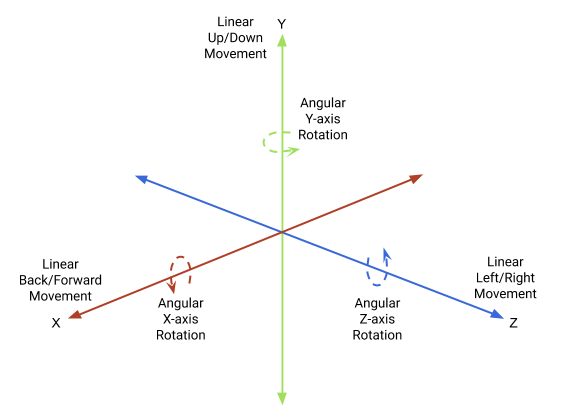

# 物理系统之约束

###### *version :2.7.0beta   Update:2020-6-2*

约束组件将一个刚体连接到另一个刚体或空间中的固定点。 对约束施加力会移动刚体，而约束的极限会限制该运动。 约束赋予刚体以下自由度：




| 约束                 | 功能                                       |
| ------------------ | ---------------------------------------- |
| Character Joint    | 模拟球窝关节(ball and socket joint)，例如臀部或肩膀。 约束所有线性自由度的刚体运动，三个角度的运动将不受限制。 附着在角色关节上的刚体围绕每个轴并基于某个原点就行旋转。(暂未实现) |
| Configurable Joint | 模拟任何骨骼关节，例如布娃娃中的那些。 您可以配置此关节以迫使刚体在任意自由度上进行运动或者对其运动进行限制。 |
| Fixed Joint        | 限制刚体跟随其所附着的刚体进行运动。 当您需要容易相互分离的刚体，或者您想要连接两个刚体的运动而无需在“变换(Transform )”层次结构中进行子父级节点设置时，这很有用。 |
| Hinge Joint        | 将一个刚体附加到另一个刚体或者是空间中的点，使刚体绕着过该点的特定轴进行旋转。 用于模拟门和手指关节。(暂未实现) |
| Spring Joint       | 使用弹簧将两个刚体进行连接，并且允许他们之间的距离发生改变，就好像它们是通过弹簧连接的一样。(暂未实现) |

约束还具有其他选项，您可以为特定效果启用这些选项。例如，您可以将约束设置为在对刚体施加的力超过特定阈值时断开。某些约束允许在连接的刚体之间产生驱动力，以使其自动运动。

在Unity中约束被称之为关节。


**LayaAir约束及其主要功能**

LayaAir约束包含有FixedConstraint(固定约束)和ConfigurableJoint(可配置约束)，他们都是继承子共同的基类ConstraintComponent，ConstraintComponent实现了基础公用的约束功能和函数，以下是LayaAir ConstraintComponent主要功能函数和属性说明：

- 设置当前约束可用或者不可用

```typescript
set enabled(value: boolean)
```

- 设置约束连接的第一个刚体

```typescript
set ownBody(value:Rigidbody3D)
```

- 设置约束连接的第二个刚体

```typescript
set connectedBody(value:Rigidbody3D)
```

- 设置最大承受力,当刚体所受力大于该阈值时，约束将会被打破并失效

```typescript
set breakForce(value:number)
```

- 设置最大承受力矩，当刚体所受的力矩大于该阈值时，约束将会被打破并失效

```typescript
set breakTorque(value:number)
```

- 设置约束的锚点，定义约束中心的点。 所有基于物理学的模拟都将这一点作为计算的中心。

```typescript
set anchor(value:Vector3)
```

- 设置约束中的连接锚点

```
set connectAnchor(value:Vector3)
```

- 设置约束计算迭代的次数，次数越高，越精确(默认为80)

```
setOverrideNumSolverIterations(overideNumIterations:number)
```


