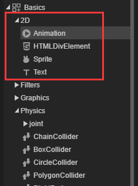

# 节点组件的分类与继承关系

> author: charley	  version: 2.0.1	update:2019-04-02

组件是LayaAir引擎的游戏设计基础，几乎无处不在。LayaAir IDE中自带有2D基础组件（2D）、滤镜组件（Filters），绘图组件（Graphics）、物理组件（physics）、UI组件（UI）、公共组件（common），如图1所示。

 

（图1）

在这些组件里，通过继承关系的不同，可以分成组件、UI组件、视图组件、基础显示组件，这几大类。

本篇，重点介绍UI组件、视图组件、基础显示组件，因为这几种组件，其实都是继承于Sprite，都具有显示列表节点的特性，可以挂接延伸子节点，所以，我们又把这些组件统称为节点组件。

而组件是指继承于**Component**类的组件，比如物理组件，虽然之前其它介绍的组件也含有组件的字样，但并非全是从属关系。比如继承于Sprite的可视化节点组件。与继承于**Component**类的组件，有着明显不同的职能与分工。**Component**类组件只能依托于节点组件实现功能。不可以作为独立的节点使用。

另外，滤镜组件Filters虽然用法与物理组件相同，但滤镜组件即不属于节点组件，也不属于组件。

绘图组件Graphics也是，虽然在IDE里的用法从表面上看，与节点相近，但同样是不属于节点组件，也不属于组件，所以，无法添加子节点。

以上这些不属于节点组件的，都不在本篇中进行介绍。

**如果想了解更多，可以查看教学视频：**

IDE与全部组件的基础教学：https://ke.qq.com/course/275321

IDE的UI基础、组件化开发、屏幕适配的视频教学合集：https://ke.qq.com/course/417469

## 1、节点组件

节点组件最基础辨别方式，就是能不能添加子节点。

根据组件自身的结构和功能，可视化节点组件又分成三大类。 分别是基础显示组件、UI组件、视图组件。

### 1.1 基础显示组件

什么是基础显示组件，就是引擎最最基础的显示组件，包括了Sprite、Text、HTMLDivElement、Animation。如1-1图所示。

 

（图1-1）

Sprite是LayaAir引擎是最基础的显示图形的显示列表节点（通常简称节点），同时也是容器。后面介绍的各种UI组件，文本组件，动画组件，富文本组件。这些基础显示组件，也都是继承自Sprite。在IDE里，图片资源如果不按UI组件规则命名，默认会被识别为Sprite，如果你把Sprite当成Image用，那你很可能会遇到坑，比如Sprite不支持9宫格，缩放后对齐有问题，不支持相对布局等。

Text是最基础的文本对象，负责文本的显示。这与UI组件中的Label也有区别。比如，Text不支持相对布局等。

HTMLDivElement是富文本显示组件，用于HTML文本。

Animation是基础的动画组件，用于播放动画文件。

### 1.2 UI组件

只有继承于UI组件类`UIComponent`的组件，才能被称为UI组件，后面讲继承关系的时候，会有图片结构，大家一会可以细看一下。

UI组件，又分成基础UI组件和容器UI组件。比较容易理解和识别的方式为，Box和继承于Box的都属于容器类组件。其它的都是基础UI组件。

##### 基础UI组件

基础UI组件，通常需要按资源命名来识别组件，这也是我们建议的方式，当然，直接转换类型（`Ctrl+T`快捷键）也是可以的。但并不是我们推荐的方案。

基础UI组件包括：Button、CheckBox、Clip、ColorPicker、ComboBox、FontClip、HScrollBar、HSlider、Image、Label、TextArea、TextInput、Radio、ProgressBar、Slider、VSlider、ScrollBar、VScrollBar、WXOpenDataViewer。

##### 容器UI组件

容器类组件通常不需要以资源命名来识别组件，而是由一个或多个基础组件通过转化为容器的方式生成而来。在IDE里可以通过`Ctrl+B`快捷键将一个或多个基础组件转化为容器组件。如动图2所示。

 

 (动图2)

容器类组件包括：Box、List、Tab、RadioGroup、ViewStack、Panel、HBox、VBox、Tree。

### 1.3 视图组件

视图组件是页面级显示对象容器。在 LayaAir IDE 的UI系统里，页面是用来承载显示所有的显示组件的，LayaAir的视图类组件分别为Scene、View、Dialog，在创建场景时使用，如图3所示。

 

 当不需要使用相对布局时默认使用Scene，当需要进行相对布局时，可以使用View。Dialog是用于制作弹窗页面时使用。

## 2、组件的继承关系

Sprite 类是 LayaAir 引擎中最基础的显示对象容器类，所有的UI组件都继承自基类Sprite，其中基础显示组件和容器组件都继承于Sprite的子类UIComponent。Sprite的子类scene是视图类组件的基类，view继承于scene，Dialog继承于view。具体的组件继承关系如图4所示。

## 3、组件属性详解入口

具体要了解各个组件的命名规则与组件的使用，请直接查看2.0的文档《IDE组件属性详解》

TS版链接地址： [https://ldc2.layabox.com/doc/?nav=zh-ts-3-3-0](https://ldc2.layabox.com/doc/?nav=zh-ts-3-3-0)

AS版链接地地：https://ldc2.layabox.com/doc/?nav=zh-as-3-3-0

JS版链接地地：https://ldc2.layabox.com/doc/?nav=zh-js-3-3-0

## 本文赞赏

如果您觉得本文对您有帮助，欢迎扫码赞赏作者，您的激励是我们写出更多优质文档的动力。

 